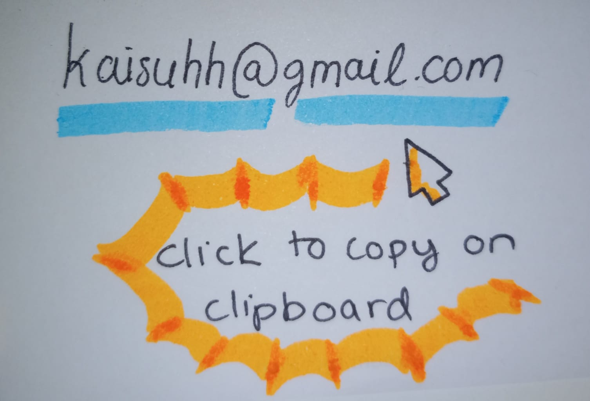

```{r setup, include=FALSE}

knitr::opts_chunk$set(echo = FALSE, message = FALSE, warning = FALSE)
```
```{=html}
<head>
  <title>Kaisu Hiltunen - Contact</title>
  <link rel="stylesheet" href="css/bootstrap.min.css">
</head>
```

```{r, echo=FALSE, results="asis"}
#  Importing the Navigation bar and some styling
htmltools::includeHTML("css/navbar.html")
```

```{=html}
<!DOCTYPE html>
<html lang="en">
<head>
<div class="container" style="margin-top: 40px;">
    <div class="col-md-12"> 
      <h3>Contact</h3>
      <p>Feel free to connect with me on <a href="https://www.linkedin.com/in/kaisu-hiltunen/">LinkedIn</a>.</p>
    
  <button class="btn-email" onclick="showEmail()">📧 Email Me</button>
    
    <!-- Hidden Image of Handwritten Email -->
    

    <p id="copy-message">✅ Email copied to clipboard!</p>

    <script>
        function showEmail() {
            document.getElementById("email-image").style.display = "block";
        }

        function copyEmail() {
            // Decode each part separately and join
            const user = atob("a2Fpc3VoaA==");  // "kaisuhh"
            const domain = atob("Z21haWwuY29t");  // "gmail.com"
            const email = user + "@" + domain;

            // Create a temporary input element
            const tempInput = document.createElement("input");
            tempInput.value = email;
            document.body.appendChild(tempInput);

            // Copy to clipboard
            tempInput.select();
            document.execCommand("copy");
            document.body.removeChild(tempInput);

            // Show confirmation message
            document.getElementById("copy-message").style.display = "block";

            // Hide the message after 2 seconds
            setTimeout(() => {
                document.getElementById("copy-message").style.display = "none";
            }, 2000);
        }
    </script>
    
    </div>
  </div>
</html>

```
