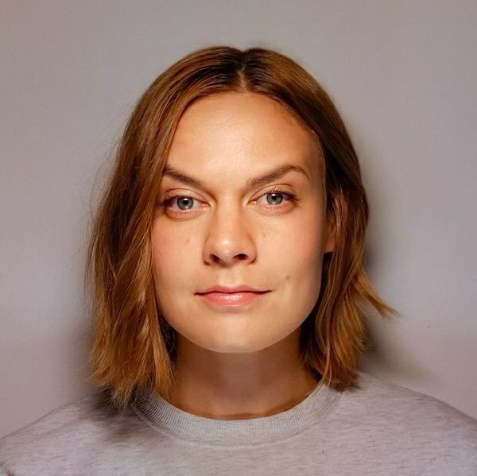

```{=html}

<head>
  <title>Kaisu Hiltunen</title>
</head>

<style>
  h1.title, .author, .date { 
    display: none; 
  }
</style>

<!-- Navigation Menu using Bootstrap Navbar -->
<nav class="navbar navbar-expand-lg navbar-dark bg-dark">
  <button class="navbar-toggler" type="button" data-toggle="collapse" data-target="#navbarNav" 
          aria-controls="navbarNav" aria-expanded="false" aria-label="Toggle navigation">
    <span class="navbar-toggler-icon"></span>
  </button>
  <div class="collapse navbar-collapse" id="navbarNav">
    <ul class="navbar-nav ml-auto">
      <!-- Adjust the href attributes to jump to your sections (requires ID attributes in your content) -->
      <li class="nav-item">
        <a class="nav-link" href="education.html">Education</a>
      </li>
      <li class="nav-item">
        <a class="nav-link" href="projects.html">Projects</a>
      </li>
      <li class="nav-item">
        <a class="nav-link" href="contact.html">Contact</a>
      </li>
    </ul>
  </div>
</nav>

```


```{r, include=FALSE}
knitr::opts_chunk$set(echo = FALSE, message = FALSE, warning = FALSE)

```

```{=html}
<style>
  /* Define a class for the circular image with text wrapping */
  .circle-wrap {
    float: right; 
    width: 200px; 
    height: 200px;
    border-radius: 50%; /* Make it circular */
    shape-outside: circle(50%);
    -webkit-shape-outside: circle(50%); /* For Webkit browsers */
    margin-left: 20px; /* Provide space between the image and the text */
    margin-bottom: 0px;
  }
  /* Default (Desktop) styling */
/* Reserve space for the image by adding a right margin to header text */
.header-container h1,
.header-container h4 {
  white-space: nowrap;           /* Prevent breaking in one line */
  margin-right: 240px;           /* Reserve space for the 200px image + extra margin */
}

/* The image stays floated to the right with circular cropping */
.circle-wrap {
  float: right; 
  width: 200px; 
  height: 200px;
  border-radius: 50%;
  shape-outside: circle(50%);
  -webkit-shape-outside: circle(50%);
  margin-left: 20px;
  margin-bottom: 0px;
}

/* When the available width is below 520px, clear the float so the text moves below the image */
@media (max-width: 520px) {
  .header-container h1,
  .header-container h4 {
    white-space: normal;  /* Allow wrapping if needed on narrow screens */
    margin-right: 0;      /* Remove the reserved margin */
  }
 
  .circle-wrap {
    float: none;          /* Remove float so the image becomes a block element */
    display: block;
    margin: 0 auto 20px;   /* Center the image horizontally and add bottom margin */
  }
  /* Optionally, clear the header text so it doesn’t sit next to the image */
  .header-container .header-text {
    clear: both;
  }
}

</style>

<style>
  /* Change link color globally */
  a {
    color: #C99A81;  /* Change this to your preferred link color */
  }
  
  /* Optionally, change link hover color */
  a:hover {
    color: #BA3FBA;  /* A darker shade for when hovering */
  }

 #about {
  overflow: hidden; /* Ensures the floating image does not push down content */
}


/*Gradient */

body {
  background: linear-gradient(300deg, #3a3f44, #272b30, #1b1f24);
  background-size: cover;
  background-attachment: fixed;
  /* color: white; Ensure text is readable */
}

</style>
```

```{=html}
<div class="container" style="margin-top: 40px;">
  <!-- Section for About -->
  <div id="about" class="row">
    <div class="col-md-12">
      <!-- Main text-->
      <h1>Kaisu Hiltunen</h1>
      
      
      <p><h4>Msc Bioinformatics and Digital Health</h4>
        <p>I am a statistician/programmer interested in modern analytics, medical research, and molecular biology. 
        I am fascinated by how genetics, artificial intelligence, and bioinformatics help us uncover the mechanisms that shape who we are and how we function. </p>
        
      <p> What excites me most is their potential to take on real-world problems and improve lives. From advancing personalized medicine to accelerating drug discovery, these technologies hold the key to solving some of the biggest challenges in healthcare and beyond. I am motivated by the idea that by decoding biological data and leveraging AI, we can make discoveries that alleviate suffering and drive meaningful progress in science and medicine. </p>
      </p>
    </div>
 </div> 

  <!-- Section for Contact-->
  <div id="contact" class="row" style="margin-top: 40px;">
    <div class="col-md-12">
      <h4>Connect</h4>
      <p>Feel free to connect with me on <a href="https://www.linkedin.com/in/kaisu-hiltunen/">LinkedIn</a>.</p>
      <p>Email: firstname + hh [at] gmail [dot] com (as in for example namehh@gmail.com) </p>
    </div>
  </div>
</div>

```

```{=html}
<!-- jQuery first (using the Slim version if you don't require AJAX) -->
<script src="https://code.jquery.com/jquery-3.5.1.slim.min.js"
        integrity="sha384-DfXdHrTsYmhbl0TnxI7nxD2PzwJXxVwr6bDbHPrmv4L0Lqxm2b2/e7tqd1tMBbHJ"
        crossorigin="anonymous"></script>

<!-- Popper.js for tooltip & popover positioning -->
<script src="https://cdn.jsdelivr.net/npm/popper.js@1.16.1/dist/umd/popper.min.js"
        integrity="sha384-9/reFTGAW83EW2RDu7xS6PJt5Fi20iUc3JYb6zFJ91n4d8M3fvJ/tD6VbvdWbcK1"
        crossorigin="anonymous"></script>

<!-- Bootstrap JS -->
<script src="https://cdn.jsdelivr.net/npm/bootstrap@4.5.2/dist/js/bootstrap.min.js"
        integrity="sha384-B0UglyR+LyLkG+pax8Pm8VAYnUfw+8kz1FfiN4FoM1pA50WM4f5gZNVglSVO8A7F"
        crossorigin="anonymous"></script>

```

