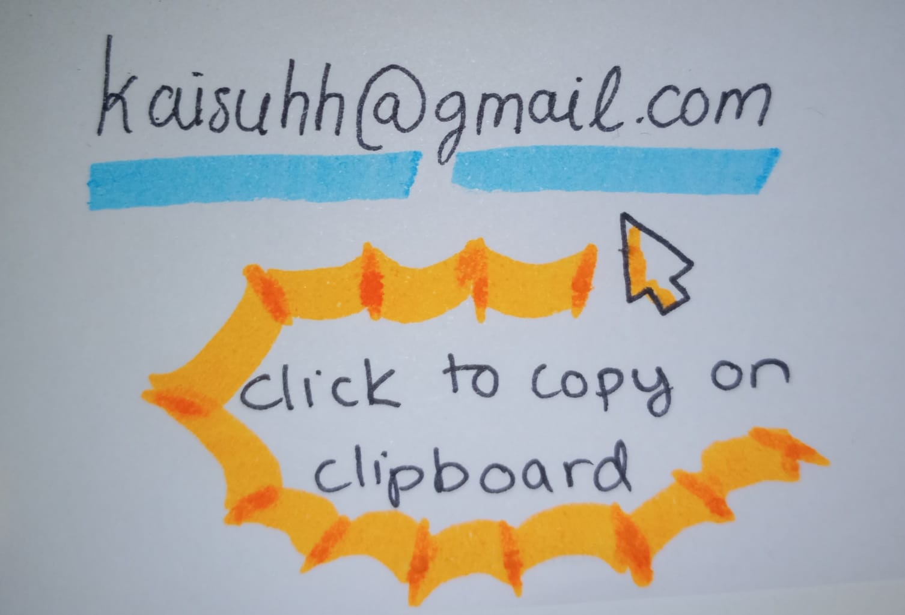

```{=html}

<head>
  <title>Kaisu Hiltunen</title>
</head>

```

```{r, echo=FALSE, results="asis"}
# Importing the Navigation bar and some styling
htmltools::includeHTML("css/navbar.html")
```

```{r, include=FALSE}
knitr::opts_chunk$set(echo = FALSE, message = FALSE, warning = FALSE)

```

```{=html}
<style>
  /* Define a class for the circular image with text wrapping */
  .circle-wrap {
    float: right; 
    width: 200px; 
    height: 200px;
    border-radius: 50%; /* Make it circular */
    shape-outside: circle(50%);
    -webkit-shape-outside: circle(50%); /* For Webkit browsers */
    margin-left: 20px; /* Provide space between the image and the text */
    margin-bottom: 0px;
  }
  /* Default (Desktop) styling */
/* Reserve space for the image by adding a right margin to header text */
.header-container h1,
.header-container h4 {
  white-space: nowrap;           /* Prevent breaking in one line */
  margin-right: 240px;           /* Reserve space for the 200px image + extra margin */
}

/* The image stays floated to the right with circular cropping */
.circle-wrap {
  float: right; 
  width: 200px; 
  height: 200px;
  border-radius: 50%;
  shape-outside: circle(50%);
  -webkit-shape-outside: circle(50%);
  margin-left: 20px;
  margin-bottom: 0px;
}

/* When the available width is below 520px, clear the float so the text moves below the image */
@media (max-width: 520px) {
  .header-container h1,
  .header-container h4 {
    white-space: normal;  /* Allow wrapping if needed on narrow screens */
    margin-right: 0;      /* Remove the reserved margin */
  }
 
  .circle-wrap {
    float: none;          /* Remove float so the image becomes a block element */
    display: block;
    margin: 0 auto 20px;   /* Center the image horizontally and add bottom margin */
  }
  /* Optionally, clear the header text so it doesn’t sit next to the image */
  .header-container .header-text {
    clear: both;
  }
}

</style>

<style>
 


/*Gradient */

body {
  background: linear-gradient(360deg, #3a3f44, #272b30, #1b1f24);
  background-size: cover;
  background-attachment: fixed;
  /* color: white; Ensure text is readable */
}

</style>
```

```{=html}
<div class="container" style="margin-top: 40px;">
  <!-- Section for About -->
  <div id="about" class="row">
    <div class="col-md-12">
      <!-- Main text-->
      <h1>Kaisu Hiltunen</h1>
      
      
      <p><h4>Msc Bioinformatics and Digital Health</h4>
        <p>I am a statistician/programmer interested in modern analytics, medical research, and molecular biology. 
        I am fascinated by how genetics, artificial intelligence, and bioinformatics help us uncover the mechanisms that shape who we are and how we function. </p>
        
      <p> What excites me most is their potential to take on real-world problems and improve lives. From advancing personalized medicine to accelerating drug discovery, these technologies hold the key to solving some of the biggest challenges in healthcare and beyond. I am motivated by the idea that by decoding biological data and leveraging AI, we can make discoveries that alleviate suffering and drive meaningful progress in science and medicine. </p>
      </p>
    </div>
 </div> 

  <!-- Section for Contact-->
  <div id="contact" class="row" style="margin-top: 40px;">
    <div class="col-md-12">
      <h4>Connect</h4>
      <p>Feel free to connect with me on <a href="https://www.linkedin.com/in/kaisu-hiltunen/">LinkedIn</a>.</p>
      
  <button class="btn-email" onclick="showEmail()">📧 Email Me</button>
    
    <!-- Hidden Image of Handwritten Email -->
    

    <p id="copy-message">✅ Email copied to clipboard!</p>

    <script>
        function showEmail() {
            document.getElementById("email-image").style.display = "block";
        }

        function copyEmail() {
            // Decode each part separately and join
            const user = atob("a2Fpc3VoaA==");  // "kaisuhh"
            const domain = atob("Z21haWwuY29t");  // "gmail.com"
            const email = user + "@" + domain;

            // Create a temporary input element
            const tempInput = document.createElement("input");
            tempInput.value = email;
            document.body.appendChild(tempInput);

            // Copy to clipboard
            tempInput.select();
            document.execCommand("copy");
            document.body.removeChild(tempInput);

            // Show confirmation message
            document.getElementById("copy-message").style.display = "block";

            // Hide the message after 2 seconds
            setTimeout(() => {
                document.getElementById("copy-message").style.display = "none";
            }, 2000);
        }
    </script>
    </div>
  </div>
</div>

```

