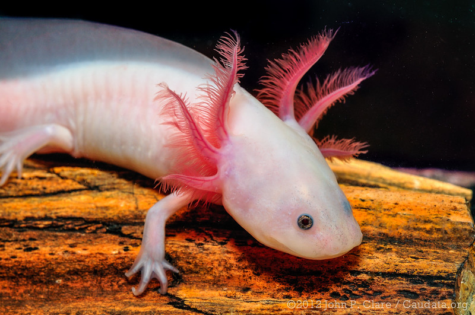

```{r setup, include=FALSE}

knitr::opts_chunk$set(echo = FALSE, message = FALSE, warning = FALSE)
```
```{=html}

<head>
  <title>Miscellaneous</title>
  <link rel="stylesheet" href="css/bootstrap.min.css">
</head>

<style>

 #about {
  overflow: hidden; /* Ensures the floating image does not push down content */
}

/* Apply same link styling to dynamically inserted answers */
  #result a {
    color: #C99A81; 
    text-decoration: none;
  }

  #result a:hover {
    color: #BA3FBA;
    text-decoration: underline;
  }
  
  .progress {
    width: 100%;
    height: 20px;
    background-color: #3a3f44;  /* Dark background */
    border-radius: 5px;
    margin: 20px auto 10px;
    overflow: hidden;
    }
    
    .progress-bar {
        height: 100%;
        width: 0%; /* Initial width */
        background-color: #62c462; /* Green progress */
        color: white;
        text-align: center;
        line-height: 20px;
        font-size: 14px;
        border-radius: 5px;
        transition: width 0.4s ease-in-out; /* Smooth animation */
    }

  
</style>

```

```{r, echo=FALSE, results="asis"}
#  Importing the Navigation bar and some styling
htmltools::includeHTML("css/navbar.html")
```


```{=html}
<!DOCTYPE html>
<html lang="en">
<head>
    <meta charset="UTF-8">
    <meta name="viewport" content="width=device-width, initial-scale=1.0">
    <title>True/False Quiz</title>
    <link rel="stylesheet" href="css/bootstrap.min.css">
    <style>
        body {
            background: linear-gradient(90deg, #1b5b50, #272b30, #661f29);
            background-size: cover;
            background-attachment: fixed;
            color: #aaa;
            text-align: center;
            font-family: -apple-system, BlinkMacSystemFont, "Segoe UI", Roboto, "Helvetica Neue", Arial, sans-serif;
        }
        .quiz-container {
            max-width: 600px;
            margin: 50px auto;
            padding: 20px;
            border-radius: 10px;
            background: #272b30;
        }
        .question {
            font-size: 20px;
            margin-bottom: 15px;
        }
        .btn {
            margin: 5px;
            padding: 10px 20px;
            font-size: 18px;
            border: none;
            cursor: pointer;
            border-radius: 5px;
        }
        .btn-true {
            background-color: #56A558;
            color: white;
        }
        .btn-false {
            background-color: #da5a57;
            color: white;
        }
        .btn:hover {
            opacity: 0.8;
        }
        .result {
            font-size: 18px;
            margin-top: 10px;
        }
        img {
            max-width: 100%;  /* Ensures the image never exceeds its container width */
            height: auto;  /* Maintains aspect ratio */
            display: block; /* Centers image properly */
            margin: 0 auto; /* Centers image horizontally */
            margin-bottom: 10px;
            margin-top: 10px;
        }
    </style>
</head>
<body>

    <div class="quiz-container">
        <h2>True/False Quiz</h2>
        <p id="question" class="question"></p>
        
        <button class="btn btn-true" onclick="checkAnswer(true)">True</button>
        <button class="btn btn-false" onclick="checkAnswer(false)">False</button>
        
        <p id="result" class="result"></p>
        <button class="btn btn-primary" onclick="nextQuestion()">Next Question</button>
        
        <p id="score" class="result" style="display: none;"></p>
        
        <div class="progress">
          <div id="progress-bar" class="progress-bar" style="width: 0%;">0%</div>
        </div>
        
    </div>

    <script>
        const questions = [
            { question: "The human genome contains around 6 billion base pairs.", answer: false, 
            explanation: "The human genome has approximately 3 billion DNA base pairs, which are distributed across 23 chromosomes."},
            
            { question: "Axolotls can regrow entire limbs, parts of their heart, and even parts of their brain.", answer: true,
            explanation: `Axolotls are the coolest animals that exist (fact). They have an extraordinary ability to regenerate not just limbs, but also spinal cord tissue and parts of their brain!
            
        

        Image Credit: <a href="https://www.flickr.com/photos/23095866@N03/6978007064" target="_blank">John P Clare (Flickr)</a>, used under <a href="https://creativecommons.org/licenses/by-nc-nd/2.0/" target="_blank">CC BY-NC-ND 2.0</a>.`
    
            },
            
            { question: "Axolotls stay in a larval-like stage their entire lives and don't normally undergo metamorphosis.", answer: true,
            explanation: "Unlike most amphibians, axolotls remain in their aquatic juvenile form for life unless exposed to certain <a href=\"https://www.nature.com/articles/104435b0\" target=\"_blank\" >hormones</a>. If they do undergo the unlikely and unfortunate event of metamorphosis they will have to undertake a completely different lifestyle as a terrestrial salamander."},
            { question: "AI can completely replace doctors today.", answer: false,
            explanation: "AI can assist doctors but for now it lacks human intuition and ethical reasoning."},
            
            { question: "Gene therapy has been utilised to regenerate the entire human epidermis.", answer: true,
            explanation: "In 2015, transgenic keratinocyte cultures were used to regenerate an <a href=\"https://pmc.ncbi.nlm.nih.gov/articles/PMC6283270/\" target=\"_blank\">entire functional epidermis</a> of a boy suffering from Junctional epidermolysis bullosa (JEB). JEB is a severe genetic disease caused by mutations in laminin-332 genes and it leads to epidermal loss and skin and mucosa wounds. Previously there was no cure for the disease and more than 40 % of patients died before adolescence."},
            
            { question: "Bioinformatics combines biology, data science, and computing.", answer: true,
            explanation: "Bioinformatics is an interdisciplinary field of science that develops methods and software tools for understanding biological data, especially when the data sets are large and complex."},
            { question: "The first programmable electronic computer was invented in the 1970s.", answer: false,
            explanation: "The world's first programmable and automatic digital computer was invented by Konrad Zuse in 1938. The <a href=\"https://horst-zuse.hier-im-netz.de/Konrad_Zuse_index_english_html/rechner_z3.htmlZ3\" target=\"_blank\">Z3</a> weighed 1000 kg and used punched celluloid tapes for program memory."},
            
            
            { question: "No animal can survive in a space vacuum or stand the unfiltered solar radiation in space.", answer: false,
            explanation: `In 2007, tardigrades were sent into space on the <a href=\"https://www.cell.com/current-biology/fulltext/S0960-9822(08)00805-1?_returnURL=https%3A%2F%2Flinkinghub.elsevier.com%2Fretrieve%2Fpii%2FS0960982208008051%3Fshowall%3Dtrue\" target=\"_blank\" >FOTON M3 mission</a> and survived direct exposure to space vacuum and cosmic radiation! Their space exploration around the Earths low orbit lasted for 10 days.

        

        Scanning electron micrograph of an adult water bear (tardigrade), Hypsibius exemplaris. Image Credit: Bob Goldstein & Vicky Madden, UNC Chapel Hill <a href="https://flic.kr/p/5kZxbg" target="_blank"> (Flickr)</a>, used under <a href="https://creativecommons.org/licenses/by-nc-nd/2.0/" target="_blank">CC BY-NC-ND 2.0</a>.`
        }
            
        ];

        let currentQuestion = 0;
        let score = 0;

        function updateProgressBar() {
            let progress = ((currentQuestion) / questions.length) * 100;
            let progressBar = document.getElementById("progress-bar");
        
            progressBar.style.width = `${progress}%`;
            progressBar.innerText = `${currentQuestion}/${questions.length}`;
        }

        function loadQuestion() {
            if (currentQuestion < questions.length) {
                document.getElementById("question").innerText = questions[currentQuestion].question;
                document.getElementById("result").innerText = "";
            } else {
                document.getElementById("question").innerText = "Quiz Completed!";
                document.getElementById("score").innerText = `Final Score: ${score} / ${questions.length}`;
                document.getElementById("score").style.display = "block";
                document.querySelector(".btn-true").style.display = "none";
                document.querySelector(".btn-false").style.display = "none";
                document.querySelector(".btn-primary").style.display = "none";
                document.getElementById("result").innerHTML = "";
                updateProgressBar();
            }
        }

        function checkAnswer(userAnswer) {
            let correctAnswer = questions[currentQuestion].answer;
            let explanation = questions[currentQuestion].explanation;
        
            if (userAnswer === correctAnswer) {
                document.getElementById("result").innerHTML = `✅ Correct! <br>${explanation}</p>`;
                score++;
            } else {
                document.getElementById("result").innerHTML = `❌ Incorrect. <br>${explanation}</p>`;
            }
        }

        function nextQuestion() {
            currentQuestion++;
            loadQuestion();
            updateProgressBar();
        }

        // Load first question on page load
        loadQuestion();
    </script>

</body>
</html>

```
```{=html}

```

